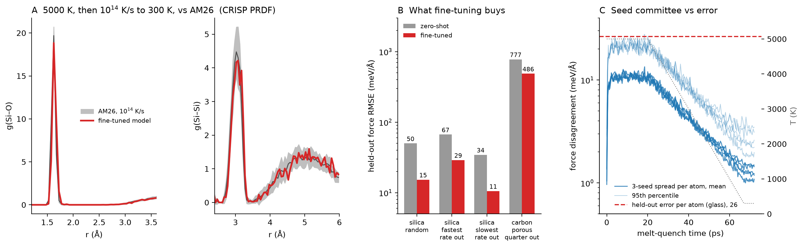

# Examples_MLIP

What I do with a MACE foundation model when a new amorphous system lands on my desk, run on
open data so that every step can be checked. I started this on 7 October 2026, after the
ML4CHEM 2026 summer school in Leipzig (COST Action DAEMON, CA22154), where I worked through
Ilyes Batatia's MACE notebooks: iterative training, active learning, foundation models, and
fine-tuning with E0 re-estimation and multihead replay. The notebooks use a small solvent
set. Here the same steps are applied to amorphous silica and carbon from the AM26 benchmark,
where the questions I care about live: how many cells make an ensemble, which quench rate a
model has seen, and how clean the reference forces are.

## What I found

- **Fine-tuning works on silica, and the seeds agree.** MACE-MPA-0 fine-tuned on 51 AM26
  silica cells takes the force RMSE on 20 held-out cells from 50 to 15 meV/Å. Three seeds land
  within 0.1 meV/Å of each other.
- **Quench rate matters, in one direction.** With the fastest rate (10¹⁴ K/s) held out the
  fine-tuned error is 29 meV/Å; with the slowest (10¹¹ K/s) held out it is 10.5. The fast
  glasses carry the coordination defects the slow ones lack.
- **Dense carbon does not teach porous carbon.** Holding out the most porous quarter, the
  force error only falls from 777 to 486 meV/Å.
- **The fine-tuned model makes its own glass.** Melted at 5000 K for 20 ps and cooled at
  10¹⁴ K/s, five runs finish without a crash. Their coordination, ring statistics and partial
  RDFs match AM26's own 10¹⁴ K/s cells within the scatter of five cells.
- **My first melt did not melt.** At 3000 K for 10 ps the network survived: 93 to 100 percent
  of the Si–O–Si bridges were kept. I first misread this. The melt-quench script now checks
  the mean squared displacement and the bridges kept at the end of every hold.
- **A seed committee is a good alarm and a poor error bar.** Its force spread rises eightfold
  in the liquid, but it stays below the true error everywhere, by a factor of twenty in the
  glass.
- **Twenty cells per quench rate are not an ensemble.** By Vitriflow's support criterion the
  Si–Si pair-distance distribution would need roughly 450 to 650 cells per rate, the same
  order as the 420 Vitriflow reported for its own silica.
- **The AM26 forces are drift-corrected.** Their net force sits at the rounding level of the
  stored numbers, so a net-force audit cannot see their SCF noise.
- **Zero-shot, silica is close and carbon is not.** On silica MACE-MH-1 reaches 33 meV/Å and
  MPA-0 49. On carbon every model misses, and the energy error of the MIT models is mostly a
  constant offset, −99 meV/atom for MPA-0 and −128 for MP-0b3.

`notebooks/tour.ipynb` walks through these results module by module, with every plot built
from the committed CSVs and a note on what was done and why; GitHub renders it with its
outputs.



*A:* Si–O and Si–Si partial RDFs (CRISP) of the five glasses the fine-tuned model made,
against AM26's twenty 10¹⁴ K/s cells (mean and ±1 standard deviation). *B:* held-out force
RMSE before and after fine-tuning for each hold-out. *C:* force spread of three seeds along
the melt-quench, against the held-out error expressed per atom; the dotted line is the
thermostat temperature. The melt-quench is also a video, `modules/story/quench_video.mp4`:
the cell with every silicon coloured by its oxygen count, next to the RDFs and the
coordination curve, frame by frame.

## Status

| Module | Question | Status, 8 Oct 2026, 15:30 CEST |
|---|---|---|
| M0 foundation triage | How far do three MACE foundation models get on amorphous silica and carbon with no fine-tuning, and does their disagreement follow their error? | done |
| M1 fine-tune | Does a MACE-MPA-0 fine-tuned on some AM26 cells transfer to cells it never saw? A random hold-out with three seeds, a learning curve and a noisy-label run; two quench-rate hold-outs; a carbon density hold-out; MD checks at 300 and 1500 K; a melt-quench at 10¹⁴ K/s compared with AM26's own 10¹⁴ K/s cells. | done, except the full-length replay run, which its walltime stopped at epoch 32 unevaluated; a 30-epoch replay run is evaluated |
| M2 ensemble support | How many independent cells before density, coordination, pair distances and ring statistics are resolved to a declared tolerance? Vitriflow's support criterion on the AM26 silica cells per quench rate and carbon cells per density. | done |
| M3 Vitriflow baseline | Vitriflow's shipped BKS silica melt-quench example, run as shipped, as the classical baseline a fine-tuned potential would replace. | not started |
| M4 label quality | Net-force audit of the AM26 reference forces, system by system. | done |

Three things I got wrong on the first pass and corrected. The AM26 file has no key named
after the quench rate; the rate sits inside the `label` field as `silica-mq_10-13_7`. So my
first silica split was a random hold-out and the first M2 pass pooled four quench rates into
one group. The random-split runs are reported as what they are, the rate hold-outs were run
as separate arms, and M2 was rerun per rate. The pair-distance CDFs were first normalised per
atom instead of to one, which inflated their ratios by about four; the tables show the
corrected version. And the first melt-quench, at 3000 K, did not melt the network, which I
first read the other way round. `modules/M1_finetune_asio2/README.md` and
`modules/story/rings_zipper_crosscheck.md` describe the check that caught it.

Every number in a README traces to a file a script here wrote under `modules/*/outputs*/` or
`modules/story/`, or is computed from those files by `tools/make_results_table.py`. A module
is "done" when those files exist and the Results block below has been regenerated from them.

## Where things are

| Folder | What is in it | In git? |
|---|---|---|
| `modules/M0_foundation_triage/outputs/`, `outputs_other_systems/` | zero-shot metrics, per-frame errors, spread-versus-error data and plots | yes |
| `modules/M1_finetune_asio2/outputs/` | held-out metrics of every fine-tune (one folder per run), MD checks, melt-quench summaries, committee spread | yes, except structures (`.xyz`) |
| `modules/M1_finetune_asio2/checkpoints/`, `logs/`, `results/` | the twelve fine-tuned models, MACE training logs and error tables | no, local only |
| `modules/M2_ensemble_support/outputs/` | support criterion per quench rate and per carbon density | yes |
| `modules/M4_label_quality/outputs/` | net-force audit | yes |
| `modules/story/` | the figures, GIF and video, with the CSVs behind them | yes |
| `modules/story/zipper_crosscheck/` | ring and network-memory checks that need ZIPPER | no, until ZIPPER is public |
| `notebooks/tour.ipynb` | the results plotted from the committed CSVs, module by module, with what was done and why | yes, executed |
| `data/` | `CHECKSUMS.json` and split manifests; the AM26 file and split structures | manifests yes, structures no |
| `hpc/` | PBS templates; filled job scripts and the job output files in `job_outputs/` | templates yes, the rest no |
| `models_cache/` | the MACE-MPA-0 base model | no |

## Results

<!-- results:start -->
**M0 zero-shot, silica and carbon** (`modules/M0_foundation_triage/outputs/metrics.csv`) Force RMSE per Cartesian component in meV/Å; relative RMSE in percent of the standard deviation of the reference force components; energies in meV/atom, the offset being the mean of predicted minus reference over the system's cells; seconds per frame on 8 CPU cores. Spearman coefficient between the force spread of the models and the error of their mean, over all atoms: a-SiO2 0.51, a-C 0.41.

| system | model | licence | n_frames | force RMSE | relative RMSE, % | energy MAE | mean energy offset | energy MAE, offset removed | s per frame |
|---|---|---|---|---|---|---|---|---|---|
| a-SiO2 | MACE-MPA-0 | MIT | 80 | 49.2 | 5.2 | 0.42 | 0.4 | 0.29 | 2.39 |
| a-SiO2 | MACE-MP-0b3 | MIT | 80 | 55.8 | 5.9 | 3.69 | 3.7 | 0.71 | 2.46 |
| a-SiO2 | MACE-MH-1 | ASL | 80 | 32.7 | 3.5 | 3.13 | 3.1 | 0.25 | 2.55 |
| a-C | MACE-MPA-0 | MIT | 100 | 693.3 | 50.9 | 99.16 | -99.2 | 13.38 | 1.94 |
| a-C | MACE-MP-0b3 | MIT | 100 | 755.9 | 55.5 | 127.57 | -127.6 | 16.44 | 2.17 |
| a-C | MACE-MH-1 | ASL | 100 | 412.2 | 30.2 | 11.18 | -6.2 | 10.02 | 3.32 |

**M0 zero-shot, the other AM26 systems, MIT models only** (`modules/M0_foundation_triage/outputs_other_systems/metrics.csv`) Systems are labelled by composition, so AM26's binary end-member cells (GeTe, Sb–Te, Li–S, P–S; 120 frames) are not in these rows. Spearman coefficient between the force spread of the models and the error of their mean, over all atoms: a-Si 0.21, a-LiPS 0.51, a-GST 0.22.

| system | model | licence | n_frames | force RMSE | relative RMSE, % | energy MAE | mean energy offset | energy MAE, offset removed | s per frame |
|---|---|---|---|---|---|---|---|---|---|
| a-Si | MACE-MPA-0 | MIT | 324 | 163.6 | 28.8 | 6.42 | -2.4 | 6.26 | 0.84 |
| a-Si | MACE-MP-0b3 | MIT | 324 | 203.6 | 35.8 | 29.15 | 28.9 | 8.85 | 0.50 |
| a-LiPS | MACE-MPA-0 | MIT | 100 | 109.9 | 23.2 | 3.93 | -1.6 | 3.53 | 1.45 |
| a-LiPS | MACE-MP-0b3 | MIT | 100 | 136.8 | 28.9 | 21.03 | -21.0 | 7.05 | 1.67 |
| a-GST | MACE-MPA-0 | MIT | 210 | 123.9 | 27.3 | 24.57 | -23.4 | 13.62 | 0.77 |
| a-GST | MACE-MP-0b3 | MIT | 210 | 175.9 | 38.8 | 43.29 | -43.3 | 21.93 | 0.68 |

**M1 held-out errors.** Force RMSE per Cartesian component in meV/Å with a 95 % bootstrap interval over the test cells; energy MAE in meV/atom. Every run starts from MACE-MPA-0. The first nine rows share one random split, so their differences can be compared directly; the rate and carbon rows use other test sets. Sources: `modules/M1_finetune_asio2/outputs/*/heldout_metrics.csv` and the per-frame files beside them.

| run | held-out set | trained on | zero-shot F | fine-tuned F | zero-shot E | fine-tuned E |
|---|---|---|---|---|---|---|
| naive, seed 0 | 20 random silica cells | 51 silica cells | 49.9 [38–62] | 15.3 [12.4–18.2] | 0.39 | 0.45 |
| naive, seed 1 | same 20 cells | same 51 cells | 49.9 [38–62] | 15.2 [12.4–18.0] | 0.39 | 0.46 |
| naive, seed 2 | same 20 cells | same 51 cells | 49.9 [38–62] | 15.3 [12.5–18.1] | 0.39 | 0.48 |
| naive, repeat | same 20 cells | same 51 cells (same split as seed 0) | 49.9 [38–62] | 15.4 [12.5–18.3] | 0.39 | 0.45 |
| naive, learning curve | same 20 cells | 40 of the 51 | 49.9 [38–62] | 16.7 [13.6–19.9] | 0.39 | 0.42 |
| naive, learning curve | same 20 cells | 20 of the 51 | 49.9 [38–62] | 26.2 [18.0–33.9] | 0.39 | 0.75 |
| naive, learning curve | same 20 cells | 10 of the 51 | 49.9 [38–62] | 26.2 [20.2–33.3] | 0.39 | 0.51 |
| naive, corrupted labels | same 20 cells | 51, 5 with noisy labels | 49.9 [38–62] | 16.4 [13.4–19.5] | 0.39 | 1.12 |
| multihead replay, 30 epochs | same 20 cells | 51 + 1000 replay | 49.9 [38–62] | 28.4 [21.7–36.2] | 0.39 | 0.95 |
| naive, rate hold-out | 20 cells at 10¹⁴ K/s | 51 at 10¹¹–10¹³ K/s | 66.7 [53–79] | 29.0 [21.2–36.9] | 0.52 | 0.45 |
| naive, rate hold-out | 20 cells at 10¹¹ K/s | 51 at 10¹²–10¹⁴ K/s | 34.4 [33–36] | 10.5 [10.2–10.9] | 0.31 | 0.51 |
| naive, carbon | 25 cells at 1.5–2.0 g/cm³ | 64 carbon cells at 2.0–3.5 g/cm³ | 776.6 [758–794] | 486.3 [472.0–500.8] | 90.96 | 12.71 |

**M1 MD check, 20 ps Langevin NVT on one held-out silica cell, float64, zero-shot and fine-tuned** (`modules/M1_finetune_asio2/outputs/md_stability/md_stability_summary.csv`)

| model | T_K | ps_completed | finished | drift, meV/atom/ps | dmin_start_A | dmin_end_A | Si CN4 at end | ms_per_step |
|---|---|---|---|---|---|---|---|---|
| zero-shot | 300 | 20 | True | -0.11 | 1.54 | 1.53 | 1.000 | 224 |
| zero-shot | 1500 | 20 | True | -0.05 | 1.54 | 1.44 | 1.000 | 225 |
| naive | 300 | 20 | True | -0.08 | 1.54 | 1.54 | 1.000 | 119 |
| naive | 1500 | 20 | True | -0.60 | 1.54 | 1.48 | 1.000 | 119 |

**M1 MD check, 20 ps Langevin NVT on one held-out silica cell, float32, fine-tuned** (`modules/M1_finetune_asio2/outputs/md_stability_am26_asio2_mpa0_naive/md_stability_summary.csv`)

| model | T_K | ps_completed | finished | drift, meV/atom/ps | dmin_start_A | dmin_end_A | Si CN4 at end | ms_per_step |
|---|---|---|---|---|---|---|---|---|
| am26_asio2_mpa0_naive | 300 | 20 | True | -0.09 | 1.54 | 1.56 | 1.000 | 31 |
| am26_asio2_mpa0_naive | 1500 | 20 | True | 0.19 | 1.54 | 1.48 | 1.000 | 31 |

**M1 melt-quench, 5000 K for 20 ps then 10¹⁴ K/s to 300 K, fine-tuned model: the model's glass against AM26's 10¹⁴ K/s cells** (`modules/M1_finetune_asio2/outputs/melt_quench_5000K/melt_quench_vs_am26.csv`) Density is set by the starting cell (fixed volume) and is not a result.

| descriptor | n_generated | generated_mean | generated_sd | n_am26 | am26_mean | am26_sd |
|---|---|---|---|---|---|---|
| density | 5 | 2.216 | 0.022 | 20 | 2.230 | 0.026 |
| frac_O_CN2 | 5 | 0.995 | 0.005 | 20 | 0.997 | 0.003 |
| frac_Si_CN4 | 5 | 0.994 | 0.013 | 20 | 0.993 | 0.007 |
| ring_mean_length_atoms | 5 | 10.998 | 0.377 | 20 | 10.978 | 0.237 |

**M1 melt-quench at 5000 K, per run** (`modules/M1_finetune_asio2/outputs/melt_quench_5000K/melt_quench_summary.csv`)

| run | start_label | finished | ms_per_step | Si MSD end of hold, Ų | (V/N)^(2/3), Ų | bridges kept | network_reset | dmin_end_A | frac_Si_CN4_end |
|---|---|---|---|---|---|---|---|---|---|
| 0 | silica-mq_10-14_1 | True | 46 | 89 | 6.1 | 0.025 | True | 1.55 | 0.970 |
| 1 | silica-mq_10-14_10 | True | 47 | 85 | 6.1 | 0.041 | True | 1.53 | 1.000 |
| 2 | silica-mq_10-14_11 | True | 56 | 92 | 6.1 | 0.045 | True | 1.55 | 1.000 |
| 3 | silica-mq_10-14_12 | True | 45 | 103 | 6.1 | 0.040 | True | 1.54 | 1.000 |
| 4 | silica-mq_10-14_13 | True | 46 | 93 | 6.0 | 0.025 | True | 1.55 | 1.000 |

The first melt-quench attempt, 10 ps at 3000 K, did not melt the network (93 to 100 percent of Si–O–Si bridges survived); its outputs stay in `melt_quench_naive/`, `melt_quench_zeroshot/` and `melt_quench_traj/` for the record and are described in `modules/M1_finetune_asio2/README.md`.

**M2 support criterion per quench rate (silica) and density (carbon), q_conv = 0.2** (`modules/M2_ensemble_support/outputs/support_summary.csv`) For carbon, density is the grouping variable, so its R = 0 is true by construction.

| system | group | descriptor | N_available | R_at_N | reached_q_conv | n_required | n needed (1/√n estimate) |
|---|---|---|---|---|---|---|---|
| a-SiO2 | 11.0 | density | 20 | 1.31 | False |  | 979 |
| a-SiO2 | 11.0 | frac_Si_CN4 | 20 | 0.00 | True | 2 | 0 |
| a-SiO2 | 11.0 | frac_O_CN2 | 20 | 0.00 | True | 2 | 0 |
| a-SiO2 | 11.0 | SiO_cdf | 20 | 0.53 | False |  | 170 |
| a-SiO2 | 11.0 | SiSi_cdf | 20 | 1.03 | False |  | 646 |
| a-SiO2 | 11.0 | OO_cdf | 20 | 0.37 | False |  | 93 |
| a-SiO2 | 11.0 | ring_pmf | 20 | 0.48 | False |  | 146 |
| a-SiO2 | 11.0 | Q | 20 | 1.31 | False |  | 979 |
| a-SiO2 | 12.0 | density | 20 | 0.96 | False |  | 514 |
| a-SiO2 | 12.0 | frac_Si_CN4 | 20 | 0.00 | True | 2 | 0 |
| a-SiO2 | 12.0 | frac_O_CN2 | 20 | 0.00 | True | 2 | 0 |
| a-SiO2 | 12.0 | SiO_cdf | 20 | 0.81 | False |  | 368 |
| a-SiO2 | 12.0 | SiSi_cdf | 20 | 0.81 | False |  | 458 |
| a-SiO2 | 12.0 | OO_cdf | 20 | 0.49 | False |  | 149 |
| a-SiO2 | 12.0 | ring_pmf | 20 | 0.46 | False |  | 120 |
| a-SiO2 | 12.0 | Q | 20 | 0.96 | False |  | 514 |
| a-SiO2 | 13.0 | density | 20 | 1.09 | False |  | 701 |
| a-SiO2 | 13.0 | frac_Si_CN4 | 20 | 0.15 | True | 16 | 14 |
| a-SiO2 | 13.0 | frac_O_CN2 | 20 | 0.04 | True | 2 | 1 |
| a-SiO2 | 13.0 | SiO_cdf | 20 | 0.57 | False |  | 188 |
| a-SiO2 | 13.0 | SiSi_cdf | 20 | 0.96 | False |  | 585 |
| a-SiO2 | 13.0 | OO_cdf | 20 | 0.57 | False |  | 192 |
| a-SiO2 | 13.0 | ring_pmf | 20 | 0.56 | False |  | 199 |
| a-SiO2 | 13.0 | Q | 20 | 1.09 | False |  | 701 |
| a-SiO2 | 14.0 | density | 20 | 0.55 | False |  | 168 |
| a-SiO2 | 14.0 | frac_Si_CN4 | 20 | 0.17 | True | 16 | 16 |
| a-SiO2 | 14.0 | frac_O_CN2 | 20 | 0.07 | True | 5 | 3 |
| a-SiO2 | 14.0 | SiO_cdf | 20 | 0.79 | False |  | 348 |
| a-SiO2 | 14.0 | SiSi_cdf | 20 | 0.95 | False |  | 526 |
| a-SiO2 | 14.0 | OO_cdf | 20 | 0.48 | False |  | 138 |
| a-SiO2 | 14.0 | ring_pmf | 20 | 0.59 | False |  | 194 |
| a-SiO2 | 14.0 | Q | 20 | 0.95 | False |  | 526 |
| a-C | 1.5 | density | 20 | 0.00 | True | 2 | 0 |
| a-C | 1.5 | frac_sp2 | 20 | 1.01 | False |  | 564 |
| a-C | 1.5 | frac_sp3 | 20 | 0.48 | False |  | 136 |
| a-C | 1.5 | CC_cdf | 20 | 1.33 | False |  | 1011 |
| a-C | 1.5 | ring_pmf | 20 | 0.54 | False |  | 183 |
| a-C | 1.5 | Q | 20 | 1.33 | False |  | 1011 |
| a-C | 2.0 | density | 20 | 0.00 | True | 2 | 0 |
| a-C | 2.0 | frac_sp2 | 20 | 0.68 | False |  | 277 |
| a-C | 2.0 | frac_sp3 | 20 | 0.59 | False |  | 198 |
| a-C | 2.0 | CC_cdf | 20 | 1.03 | False |  | 665 |
| a-C | 2.0 | ring_pmf | 20 | 0.45 | False |  | 121 |
| a-C | 2.0 | Q | 20 | 1.03 | False |  | 665 |
| a-C | 2.5 | density | 20 | 0.00 | True | 2 | 0 |
| a-C | 2.5 | frac_sp2 | 20 | 0.80 | False |  | 363 |
| a-C | 2.5 | frac_sp3 | 20 | 0.81 | False |  | 377 |
| a-C | 2.5 | CC_cdf | 20 | 1.22 | False |  | 857 |
| a-C | 2.5 | ring_pmf | 20 | 0.41 | False |  | 107 |
| a-C | 2.5 | Q | 20 | 1.22 | False |  | 857 |
| a-C | 3.0 | density | 20 | 0.00 | True | 2 | 0 |
| a-C | 3.0 | frac_sp2 | 20 | 0.95 | False |  | 502 |
| a-C | 3.0 | frac_sp3 | 20 | 1.00 | False |  | 556 |
| a-C | 3.0 | CC_cdf | 20 | 1.08 | False |  | 673 |
| a-C | 3.0 | ring_pmf | 20 | 0.30 | False |  | 57 |
| a-C | 3.0 | Q | 20 | 1.08 | False |  | 673 |
| a-C | 3.5 | density | 20 | 0.00 | True | 2 | 0 |
| a-C | 3.5 | frac_sp2 | 20 | 0.48 | False |  | 125 |
| a-C | 3.5 | frac_sp3 | 20 | 0.51 | False |  | 149 |
| a-C | 3.5 | CC_cdf | 20 | 0.80 | False |  | 381 |
| a-C | 3.5 | ring_pmf | 20 | 0.32 | False |  | 60 |
| a-C | 3.5 | Q | 20 | 0.80 | False |  | 381 |

**M4 net force of the AM26 reference labels, |ΣF|/N in meV/Å** (`modules/M4_label_quality/outputs/net_force_summary.csv`) Rows marked `unknown:` are AM26's binary end-member cells, labelled by composition.

| system | n_frames | median_meV_A | p95_meV_A | max_meV_A | fraction_above_1_meV_A |
|---|---|---|---|---|---|
| a-C | 100 | 3.2e-07 | 6.0e-07 | 6.4e-07 | 0.00 |
| a-GST | 210 | 3.1e-07 | 5.2e-07 | 7.6e-07 | 0.00 |
| a-LiPS | 100 | 2.8e-07 | 4.9e-07 | 5.9e-07 | 0.00 |
| a-Si | 324 | 3.8e-07 | 9.1e-07 | 1.2e-06 | 0.00 |
| a-SiO2 | 80 | 3.1e-07 | 4.6e-07 | 6.5e-07 | 0.00 |
| unknown:GeTe | 40 | 3.3e-07 | 5.7e-07 | 7.5e-07 | 0.00 |
| unknown:LiS | 20 | 2.6e-07 | 3.8e-07 | 4.3e-07 | 0.00 |
| unknown:PS | 20 | 2.3e-07 | 4.7e-07 | 4.9e-07 | 0.00 |
| unknown:SbTe | 40 | 2.6e-07 | 4.9e-07 | 5.4e-07 | 0.00 |
<!-- results:end -->

## Data

AM26 (Fragapane and Deringer, 2026): melt-quenched cells of amorphous carbon, silicon,
silica, Li-P-S and Ge-Sb-Te with PBE energies and forces, one extxyz file. `data/get_am26.py`
downloads it and checks the SHA-256 recorded in `data/CHECKSUMS.json`. `data/inspect_am26.py`
prints the metadata keys, so splits are made on fields that exist rather than on assumed
names. `data/make_splits.py` writes train, validation and test files plus a manifest that
lists every source index, and `--verify` shows the three files share none. No data file is
committed.

## Models

The foundation models are listed in `modules/M0_foundation_triage/models.yaml` with their
licences. MACE-MP-0b3 and MACE-MPA-0 are MIT. MACE-MH-1 is under the Academic Software
License. It is evaluated in M0 only: no model derived from it is trained or redistributed,
and its predictions appear here only as evaluation results. The fine-tunes start from
MACE-MPA-0 so that they could be released under MIT. No dispersion correction is applied
anywhere. AM26 labels are plain PBE, and so are the MIT models, but for the low-density
carbon cells this choice should be remembered when reading M0.

## How to run

```bash
conda env create -f environment.yml && conda activate examples-mlip && pip install -e .
pytest                                             # 16 tests, CPU, no data, no network
python data/get_am26.py                            # download and verify the checksum
python data/inspect_am26.py
python data/make_splits.py --system a-SiO2         # random hold-out (no rate key in AM26)
python data/make_splits.py --system a-SiO2 --group-key label --group-regex '10-(\d+)' \
    --holdout max --out data/splits/a-SiO2_rate14  # the fastest quench rate held out
python modules/M0_foundation_triage/run.py --systems a-SiO2 a-C
python modules/M2_ensemble_support/run.py --system a-SiO2 --group-key label --group-regex '10-(\d+)'
python modules/M4_label_quality/run.py
python tools/make_results_table.py                 # rewrites the Results block from the CSVs
pip install -e ".[notebook]" && jupyter nbconvert --to notebook --execute notebooks/tour.ipynb   # re-runs the tour
```

Fine-tuning runs through `mace_run_train` with the YAML files in `modules/M1_finetune_asio2/`;
its README gives the commands for every arm, the MD check and the melt-quench, and
`data/README.md` the other splits. The PBS templates in `hpc/` carry placeholders for queue,
walltime and environment, and `hpc/README.md` lists the exact submissions. The figures are
rebuilt with `tools/story_plots.py`, `tools/story_dynamic.py` and `tools/story_video.py`, each
given a CRISP checkout with `--crisp-src`.

## What this repository does not show

Agreement with experiment. The labels and the MIT models share the PBE level, so M0 and M1
measure consistency with PBE, not accuracy against diffraction. M2 applies a convergence
criterion to someone else's structures and is not a Vitriflow run, and M3 has not been
started. No method here is new: each module follows a published one, and `CREDITS.md` names
it. CRISP and ZIPPER, used for parts of the analysis, are my own codes.

## Provenance

Everything here was written for this repository against public data. `tools/check_repo.sh`
runs in CI on every push and refuses structure files, model checkpoints and absolute paths.

## Licence and credits

Code under MIT, see `LICENSE`. Datasets, models and methods: `CREDITS.md`.
